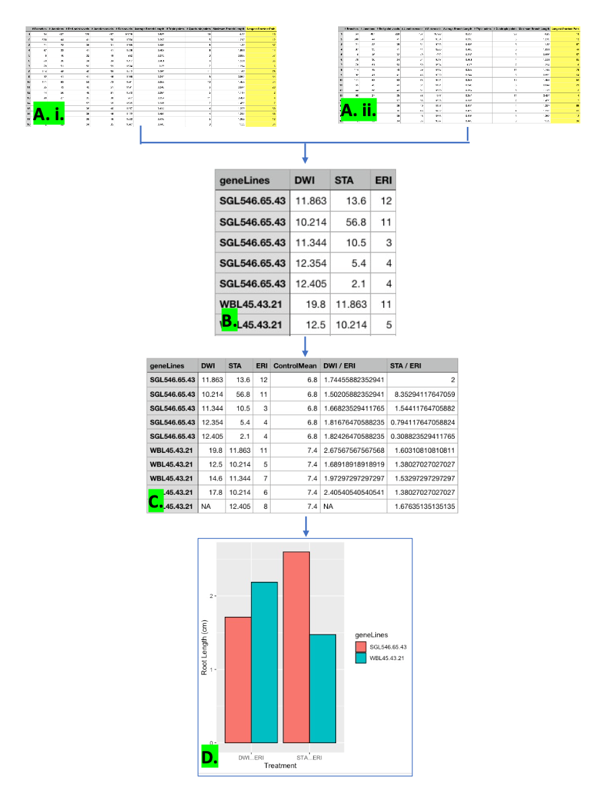

<!-- README.md is generated from README.Rmd. Please edit that file -->

```{r, include = FALSE}
knitr::opts_chunk$set(
  collapse = TRUE,
  comment = "#>",
  fig.path = "man/figures/README-",
  out.width = "100%"
)
```

# FastRPA

<!-- badges: start -->
<!-- badges: end -->

The goal of FastRPA is to speed up the interpretation time of root length measurement data. 
Manually selecting, organizing and analysing data of potentially thousands of root measurements are time consuming. FastRPA enables a semi-automatic solution, enabling the user to select root length measurements from the multiple output file of FastIDR imageJ tool, thereby centralizing data from numerous data files. 

## Installation

You can install the development version of FastRPA like so:

## Overview 

FastRPA contains 3 functions: _*filterData*_, _*analyseRootData*_, and _*createRootBarG*_. 
\n 
_*filterData*_ is the first function in the process. As input for _*filterData*_ the user must specify a column index of the root measurements to be extracted, the .csv input file (Fig.1 A.i. and Fig.1 A.ii.) , an output file, and the Treatment type used on the roots.It will allow the user to select different Root length measurements and the corresponding Gene Lines from a user defined .csv files. The _*filterData()*_ function will then take the selected root measurements and move them to a new user defined file (Fig. 1B.),to centralize all root length measurement from different Root Measurement containing .csv files. 

_*analyseRootData*_ takes in an input file (prefferably the output file from _*filterData*_ Fig. 1B), the control Treatment, and an output file. _*analyseRootData*_ will then based on the indciated controlTreatment normalize each of the treatment data and output the data to the desired output file (Fig. 1C).

_*createRootBarG*_ takes in an input file (the output file from _*analyseRootData*_ (Fig.1C)). *createRootBarG*_ creates a bar plot of the specified treatments and their corresponding gene lines (Fig. 1.D) . 

An overview of the package is illustrated below in Figure 1.: 


<div style="text-align:center">

``` r

```

## Example

This is a basic example which shows you how to solve a common problem:

```{r example}

## basic example code
```

What is special about using `README.Rmd` instead of just `README.md`? You can include R chunks like so:

```{r cars}
summary(cars)
```

You'll still need to render `README.Rmd` regularly, to keep `README.md` up-to-date. `devtools::build_readme()` is handy for this. You could also use GitHub Actions to re-render `README.Rmd` every time you push. An example workflow can be found here: <https://github.com/r-lib/actions/tree/v1/examples>.

You can also embed plots, for example:

```{r pressure, echo = FALSE}
plot(pressure)
```

In that case, don't forget to commit and push the resulting figure files, so they display on GitHub and CRAN.
