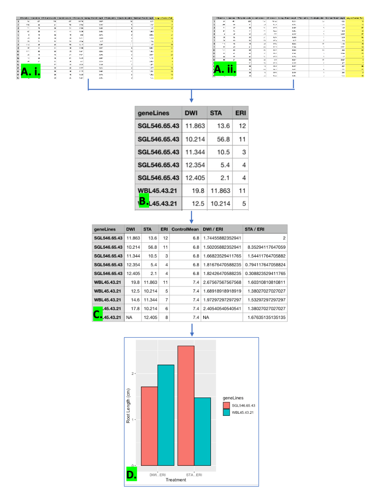

<!-- README.md is generated from README.Rmd. Please edit that file -->

# FastRPA

<!-- badges: start -->
<!-- badges: end -->

The goal of FastRPA is to speed up the interpretation time of root
length measurement data. Manually selecting, organizing and analysing
data of potentially thousands of root measurements are time consuming.
FastRPA enables a semi-automatic solution, enabling the user to select
root length measurements from the multiple output file of FastIDR imageJ
tool, thereby centralizing data from numerous data files. For an example
process: check vignettes.

## Installation

You can install the development version of FastRPA like so:

``` r
require("devtools")
devtools::install_github("anjalisilva/FastRPA", build_vignettes = TRUE)
library("FastRPA")
```

Shiny app: Under construction

## Overview

FastRPA contains 3 functions: **filterData**, **analyseRootData**, and
**createRootBarG**. **filterData** is the first function in the process.
As input for **filterData** the user must specify a column index of the
root measurements to be extracted, the .csv input file (Fig.1 A.i. and
Fig.1 A.ii.) , an output file, and the Treatment type used on the
roots.It will allow the user to select different Root length
measurements and the corresponding Gene Lines from a user defined .csv
files. **analyseRootData** takes in an input file (prefferably the
output file from **filterData** Fig. 1B), the control Treatment, and an
output file. **analyseRootData** will then based on the indciated
controlTreatment normalize each of the treatment data and output the
data to the desired output file (Fig. 1C).

**createRootBarG** takes in an input file (the output file from
**analyseRootData** (Fig.1C)). *createRootBarG*\_ creates a bar plot of
the specified treatments and their corresponding gene lines (Fig. 1.D) .

An overview of the package is illustrated below in Figure 1. :

<div style="text-align:center">

<div style="text-align:left">


## Citation for Package

<div style="text-align:left">

[Ensminger, E. (2021) FastRPA (Root length measurement analysis tool):
an R package for organizing, analysing and visualization of plant root
length measurement data)](https://github.com/ErikEnsminger/FastRPA)

## Contributions

The author of this package is Erik Ensminger. The **filterData**
function makes use of split function of the `plyr` R package for binding
data frames. The **createRootBarG** function makes use of the `reshape2`
R package for the melting dataframes. In addition, **createRootBarG**
function makes use of the `ggplot` R package for plotting the Bar graph
of the root length data.

## References

Steipe B., ABC project (.utility 4.07) A Bioinformatics Course: Applied
Bioinformatics
<http://steipe.biochemistry.utoronto.ca/abc/index.php/Bioinformatics_Main_Page>

Wickham H (2007). “Reshaping Data with the reshape Package.” Journal of
Statistical Software, 21(12), 1–20. <http://www.jstatsoft.org/v21/i12/>.

Wickham H (2011). “The Split-Apply-Combine Strategy for Data Analysis.”
Journal of Statistical Software, 40(1), 1–29.
<http://www.jstatsoft.org/v40/i01/>.

Wickham H (2016). ggplot2: Elegant Graphics for Data Analysis.
Springer-Verlag New York. ISBN 978-3-319-24277-4,
<https://ggplot2.tidyverse.org>.

Wickham, H. and Bryan, J. (2019). R Packages (2nd edition). Newton,
Massachusetts: O’Reilly Media. <https://r-pkgs.org/>

## Acknowledgements

This package was developed as part of an assessment for 2021 BCB410H:
Applied Bioinfor- matics, University of Toronto, Toronto, CANADA.
