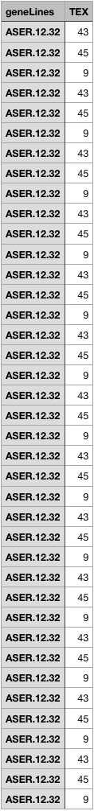
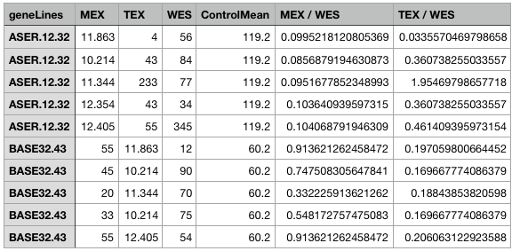
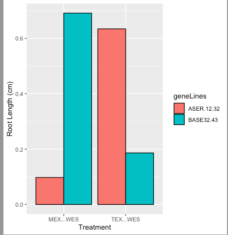

```{r, include = FALSE}
knitr::opts_chunk$set(
  collapse = TRUE,
  comment = "#>"
)
```

## Introduction

`FastRPA` is a tool for the filtering, organizing, analysing and plotting of root length measurement data. This tool enables users to select root length measurements from multiple files containing root length measurements. This allows to organize data in acentrale location from numerous data files. In addition, root measurements can be normalized according to the control Treatment. A plot can also be generated to have a simple visualization of the data. This document gives a tour of the FastRPA package. 

To download **FastRPA**, use the following commands:

```r
require("devtools")
devtools::install_github("ErikEnsminger/FastRPA", build_vignettes = TRUE)
library("FastRPA")
```

To list all functions available in this package:

```r
ls("package:gscVisualizer")
```

To view sample dataset in this package, follow the package path: 
`FastRPA/inst/extdata/`
## Components

There are 3 functions in this package: `filterData`,  `analyseRootData`, and `createRootBarG`. 

`filterData` allows for the user to input a file containing root length measurements, select certain root length measurements from this file and add them to a user defined output file. Repeating the `filterData` for numerous files containing different root length measurements allows for the fast collection of measurements to one file. 

`analyseRootData` allows for the user to take the output file from `filterData` (which contains the all the different root measurements) and normalize the data based on a user defined control Treatment that must exist in the data set. The mean of each root length with respect to root treatment and the geneLines is then calculated. The resulting data is then exported to a new user defined output file. 

`createRootBarG` allows for the bar plotting of root length measurements from the output file of `analyseRootData`, with respect to the experimental treatment and the gene lines. 

## Example

Here is an example workflow using all 3 functions. All the input and output data for each functions can be found 
under under the file path: `FastRPA/inst/extdata/`

Using `filterData`: <br />

Precondition the user input: Column name for root length measurements 
must be: `Longest Shortest Path`

```r
input <- system.file("extdata", "inputFileFunc1.csv", package = "FastRPA")
roi <- c(2,1,5)
outputFile <- system.file("extdata", "outputFileFunc1.csv", package = "FastRPA")
filterData <- filterData(inputFile = input, roi = roi, rootLines = "ASER.12.32",
                           rootTreatment = "TEX", outputFile = outputFile)
```
** Output: **

<div style="text-align:center">
<div style="text-align:left">

`Output Explanation:` Here column 1 contains the gene lines, in this case *ASER.12.32* 
The remaining columns will contain the respective root Treatments with the rows containing the root length measurements (mm). 

Using `analyseRootData`: <br />
Precondition for the user input file: Last column in the .csv file must contain the 
control treatment. 
```r
input <- system.file("extdata", "inputFileFunc2.csv", package = "FastRPA")
  outputFile <- system.file("extdata", "outputFileFunc2.csv", package = "FastRPA")
  analyseRoot <- analyseRootData(inputFile = input, controlTreatment = "WES",
                           outputFile = outputFile)
```
**Output:**
<div style="text-align:center">
<div style="text-align:left">

<br /> 

Using `createRootBar`: <br />
Precondition for user input file: Columns with treatment values to be plotted
must include `/` character 

```r 
  input <- system.file("extdata", "inputFileFunc3.csv", package = "FastRPA")
  filterData <- createRootBarG(input)
```

** Output: ** 
<div style="text-align:center">
<div style="text-align:left">

## Package References
<div style="text-align:left">
[Ensminger, E. (2021) FastRPA (Root length measurement analysis tool): an R package for organizing, analysing and visualization of plant root length measurement data) 
](https://github.com/ErikEnsminger/FastRPA)

<br>

## Other References 
<div style="text-align:left">
Steipe B., ABC project (.utility 4.07) A Bioinformatics Course: Applied Bioinformatics http://steipe.biochemistry.utoronto.ca/abc/index.php/Bioinformatics_Main_Page

Wickham H (2007). “Reshaping Data with the reshape Package.” Journal of Statistical Software, 21(12), 1–20. http://www.jstatsoft.org/v21/i12/. 

Wickham H (2011). “The Split-Apply-Combine Strategy for Data Analysis.” Journal of Statistical Software, 40(1), 1–29. http://www.jstatsoft.org/v40/i01/. 

Wickham H (2016). ggplot2: Elegant Graphics for Data Analysis. Springer-Verlag New York. ISBN 978-3-319-24277-4, https://ggplot2.tidyverse.org. 

Wickham, H. and Bryan, J. (2019). R Packages (2nd edition). Newton, Massachusetts: O’Reilly Media. https://r-pkgs.org/
